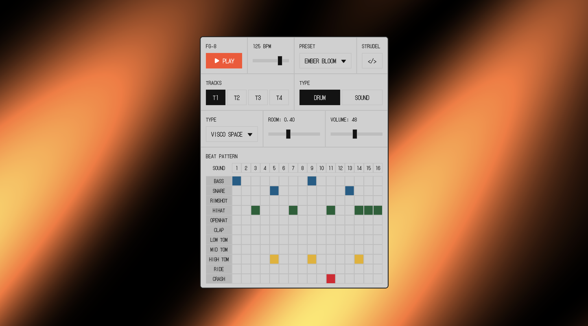
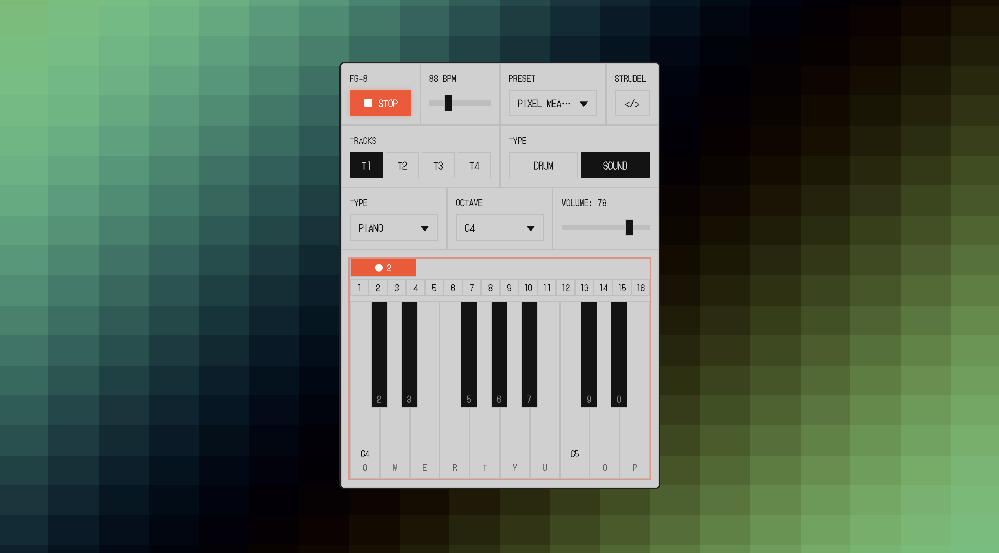
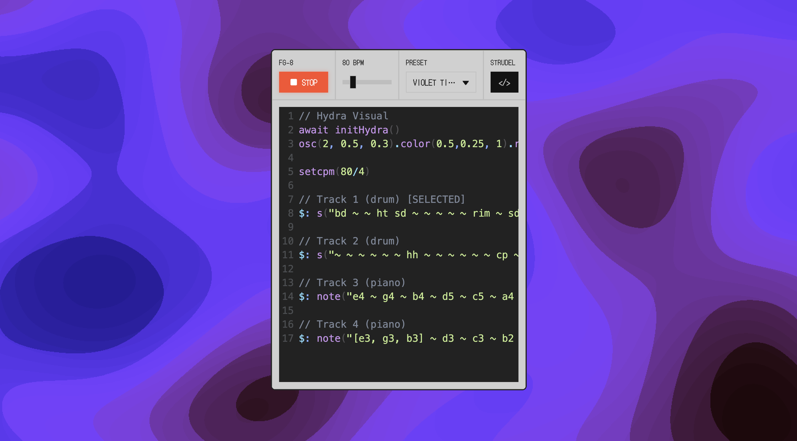
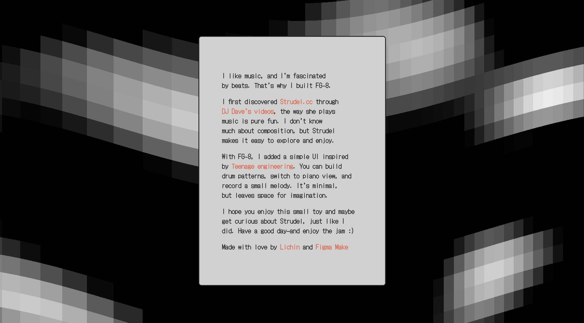

# FG-8 | Sound Machine 🎹

Tiny playful sound & pattern machine inspired by Teenage Engineering devices and the live-coding world of Strudel. You can build drum patterns, switch to a piano view, record a small melody, or just make sounds with code.  It’s minimal, but leaves space for imagination. ☁️

### Preview


| Drum pattern | Piano view |
|:--:|:--:|
|  |  |
| Live code REPL | Cover |
|  |  |


---

### 🚀 Live & Resources
- Production / playground: https://sound-machine.figma.site/
- Figma community file: https://www.figma.com/community/file/1547754442794574455/fg-8-sound-machine
- Tweet walkthrough: https://x.com/lichinlin/status/1965875092367474876

---

### ✨ Core Ideas
- Drums: Build quick rhythmic patterns.
- Piano: Simple playable keyboard + tiny melody capture.
- Code: Live-coded sounds via Strudel (mini REPL embedded).
- Minimal UI: Influenced by Teenage Engineering’s tactile aesthetic.
- Open sandbox: A toy first—no heavy workflow, just play.

---

### 🧪 Tech Stack
- Vite + React + TypeScript
- Tailwind CSS
- Radix UI primitives
- Tone.js for piano sounds
- Strudel for live-coded patterns
- Hydra for live coding video synth
- Small utility + visualization components for timing/context

---

### 🎼 Strudel Reference Corner
If you’re new to live coding or Strudel, start here:

| Thing | Link |
|-------|------|
| Web REPL | https://strudel.cc/ |
| Getting Started Workshop | https://strudel.cc/workshop/getting-started/ |
| Inspiration – DJ Dave | https://www.instagram.com/dj_dave____/ |
| Intro talk | https://www.youtube.com/watch?v=oqyAJ4WeKoU |
| The basics of live coding using Strudel | https://www.youtube.com/watch?v=QRJ0xrjLj6A |

Some fun starting snippets (paste into the Strudel panel):
```js
bass: sound("[bd <hh hh*1 oh>]*4")
  .bank('tr909')
  .spread(".8")
  .delay(0.2)
  .gain(0.3)
```
```js
samples('shabda/speech:consciousness,quantum')

$: arrange(
  [8, note("c1").s("consciousness").loopAt(choose(0.3, 0.25)).scrub("<0@3 0.48!2 ~>*3")._punchcard({width: 600})],
  [4, note("<c1>*2").s("quantum")],
  [4, "~"],
  [4, note("<g1>*1").s("quantum")],
  [4, "~"],
  [4, note("<c1>*2").s("quantum")],

```

---

### 🛠️ Local Development
Install dependencies:
```
npm install
```
Start dev server:
```
npm run dev
```
The app should be available at the Vite dev URL (typically http://localhost:3000/).

---

### 📁 Repo Structure
- `src/components/*` – UI + interaction pieces (drums, piano, sliders, REPL, etc.)
- `src/utils/*` – Audio & mapping helpers (Tone.js + Strudel glue)
- `src/styles/` – Global styles & Tailwind layers
- `src/types/` – Type declarations

---

### 🙏 Inspirations & Thanks
- Teenage Engineering (visual + playful ethos) – https://teenage.engineering/
- Strudel community – https://strudel.cc/


---

### 📬 Feedback / Ideas
Open an issue or remix the Figma file—this is intentionally small, but open to thoughtful extensions.

Enjoy exploring. Make noise. Iterate. 🎧
